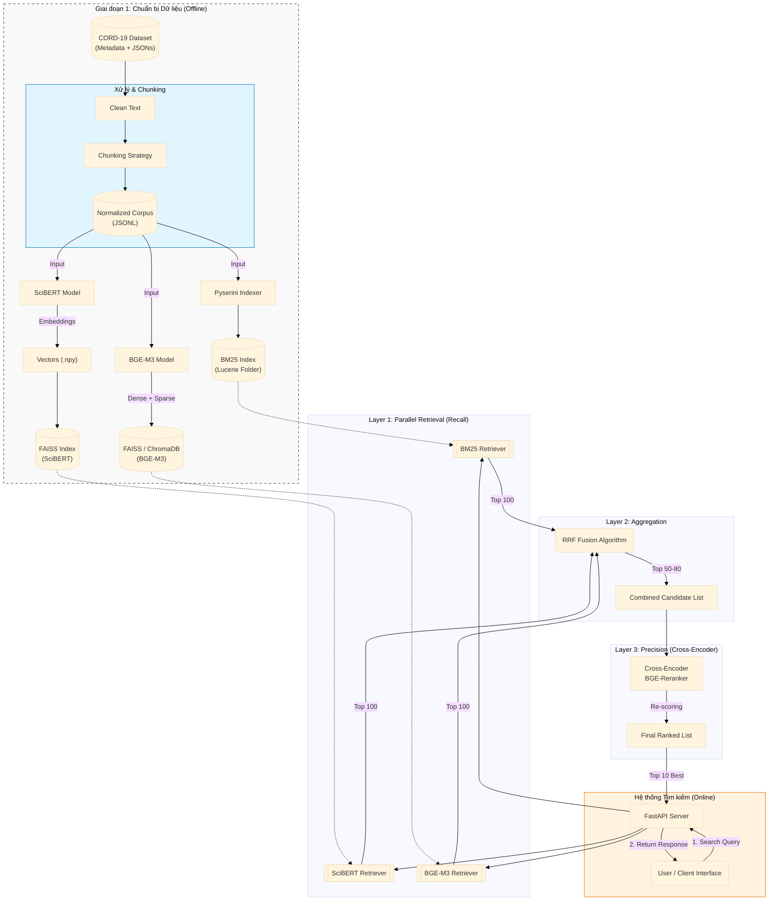

```mermaid
%%{init: {'theme': 'base', 'themeVariables': { 'fontSize': '14px', 'fontFamily': 'arial' }}}%%
flowchart TB
  %% --- KHỐI GIAI ĐOẠN 1 (OFFLINE) ---
  subgraph Offline_Process ["Giai đoạn 1: Chuẩn bị Dữ liệu (Offline)"]
    direction TB
    RawData[("CORD-19 Dataset<br/>(Metadata + JSONs)")]

    %% Lồng Subgraph Chunking vào trong cho đúng logic
    subgraph Preprocessing_Group ["Xử lý & Chunking"]
        Step1["Clean Text"]
        Step2["Chunking Strategy"]
        JSONL[("Normalized Corpus<br/>(JSONL)")]
    end
    
    %% Luồng dữ liệu nội bộ
    RawData --> Step1
    Step1 --> Step2
    Step2 --> JSONL

    %% Các nhánh Indexing
    Pyserini["Pyserini Indexer"]
    Index_BM25[("BM25 Index<br/>(Lucene Folder)")]
    
    SciBERT["SciBERT Model"]
    Vector_Sci["Vectors (.npy)"]
    Index_SciBERT[("FAISS Index<br/>(SciBERT)")]
    
    BGE["BGE-M3 Model"]
    Index_BGE[("FAISS / ChromaDB<br/>(BGE-M3)")]

    %% Kết nối từ JSONL sang các nhánh
    JSONL -- Input --> Pyserini & SciBERT & BGE
    Pyserini --> Index_BM25
    SciBERT -- Embeddings --> Vector_Sci
    Vector_Sci --> Index_SciBERT
    BGE -- Dense + Sparse --> Index_BGE
  end

  %% --- KHỐI RETRIEVAL ---
  subgraph Retrieval_Layer ["Layer 1: Parallel Retrieval (Recall)"]
    Ret_BM25[["BM25 Retriever"]]
    Ret_SciBERT[["SciBERT Retriever"]]
    Ret_BGE[["BGE-M3 Retriever"]]
  end

  %% --- KHỐI FUSION ---
  subgraph Fusion_Layer ["Layer 2: Aggregation"]
    RRF("RRF Fusion Algorithm")
    Candidates["Combined Candidate List"]
  end

  %% --- KHỐI RERANKING ---
  subgraph Reranking_Layer ["Layer 3: Precision (Cross-Encoder)"]
    CrossEnc["Cross-Encoder<br/>BGE-Reranker"]
    SortedList["Final Ranked List"]
  end

  %% --- KHỐI ONLINE SERVING ---
  subgraph Online_Serving ["Hệ thống Tìm kiếm (Online)"]
    Client("User / Client Interface")
    FastAPI["FastAPI Server"]
  end

  %% --- ĐỊNH NGHĨA LUỒNG DỮ LIỆU GIỮA CÁC KHỐI ---
  
  %% Kết nối Index sang Retriever (Dùng nét đứt biểu thị việc đọc file index)
  Index_BM25 -.-> Ret_BM25
  Index_SciBERT -.-> Ret_SciBERT
  Index_BGE -.-> Ret_BGE
  
  %% Luồng người dùng
  Client -- "1. Search Query" --> FastAPI
  FastAPI --> Ret_BM25 & Ret_SciBERT & Ret_BGE
  
  %% Kết quả Retrieval
  Ret_BM25 -- Top 100 --> RRF
  Ret_SciBERT -- Top 100 --> RRF
  Ret_BGE -- Top 100 --> RRF
  
  %% Xử lý kết quả
  RRF -- "Top 50-80" --> Candidates
  Candidates --> CrossEnc
  CrossEnc -- "Re-scoring" --> SortedList
  SortedList -- Top 10 Best --> FastAPI
  FastAPI -- "2. Return Response" --> Client

  %% --- STYLE (Tùy chọn màu sắc cho đẹp) ---
  style Offline_Process fill:#f9f9f9,stroke:#333,stroke-dasharray: 5 5
  style Preprocessing_Group fill:#e1f5fe,stroke:#0277bd
  style Online_Serving fill:#fff3e0,stroke:#ef6c00
```
