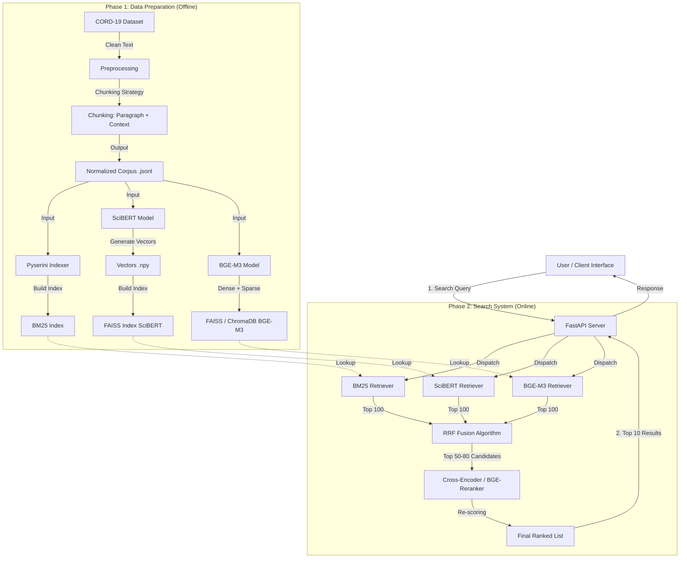

```mermaid
graph TD
    %% Client Entry Point
    Client[User / Client Interface] -->|1. Search Query| FastAPI[FastAPI Server]

    %% Phase 1: Offline Processing
    subgraph Offline["Phase 1: Data Preparation (Offline)"]
        RawData[CORD-19 Dataset] -->|Clean Text| Preproc[Preprocessing]
        Preproc -->|Chunking Strategy| Chunker[Chunking: Paragraph + Context]
        Chunker -->|Output| JSONL[Normalized Corpus .jsonl]

        %% Indexing Pipelines
        JSONL -->|Input| Pyserini[Pyserini Indexer]
        Pyserini -->|Build Index| IndexBM25[BM25 Index]

        JSONL -->|Input| SciBERT[SciBERT Model]
        SciBERT -->|Generate Vectors| VecSci[Vectors .npy]
        VecSci -->|Build Index| IndexSciBERT[FAISS Index SciBERT]

        JSONL -->|Input| BGE[BGE-M3 Model]
        BGE -->|Dense + Sparse| IndexBGE[FAISS / ChromaDB BGE-M3]
    end

    %% Phase 2: Online Search System
    subgraph Online["Phase 2: Search System (Online)"]
        %% Retrieval Layer
        FastAPI -->|Dispatch| RetBM25[BM25 Retriever]
        FastAPI -->|Dispatch| RetSci[SciBERT Retriever]
        FastAPI -->|Dispatch| RetBGE[BGE-M3 Retriever]

        %% Index Lookups
        IndexBM25 -.->|Lookup| RetBM25
        IndexSciBERT -.->|Lookup| RetSci
        IndexBGE -.->|Lookup| RetBGE

        %% Fusion Layer
        RetBM25 -->|Top 100| RRF[RRF Fusion Algorithm]
        RetSci -->|Top 100| RRF
        RetBGE -->|Top 100| RRF

        %% Reranking Layer
        RRF -->|Top 50-80 Candidates| CrossEnc[Cross-Encoder / BGE-Reranker]
        CrossEnc -->|Re-scoring| FinalList[Final Ranked List]
    end

    %% Output Loop
    FinalList -->|2. Top 10 Results| FastAPI
    FastAPI -->|Response| Client
```
