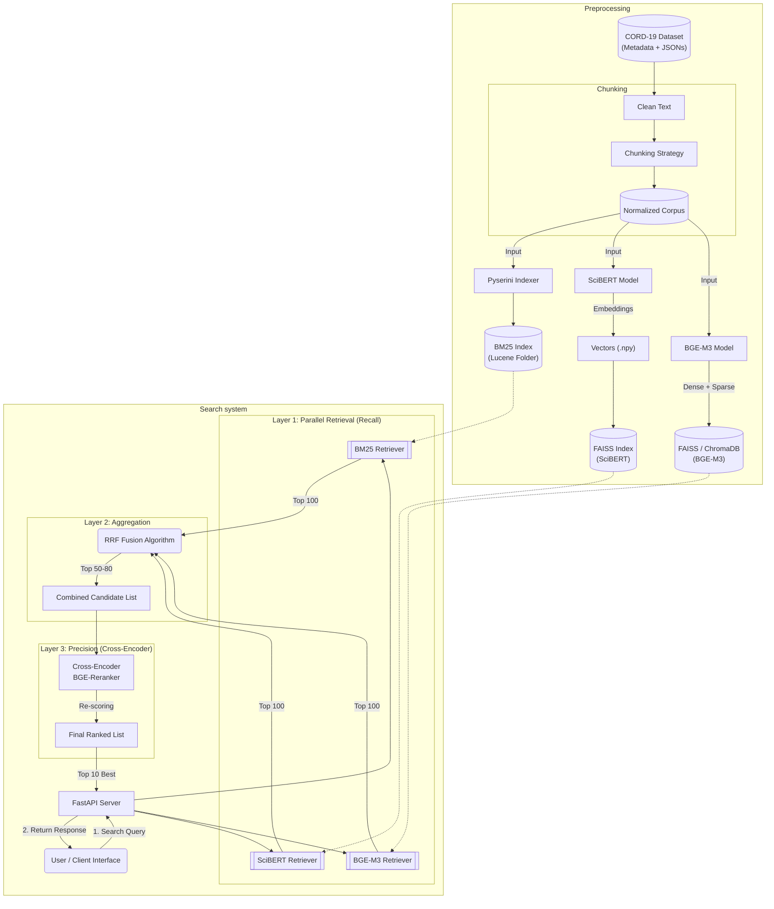

```mermaid
flowchart TB
  %% --- KHAI BÁO CÁC NHÓM (SUBGRAPH) ---
  subgraph Preprocessing ["Chunking"]
    Step1["Clean Text"]
    Step2["Chunking Strategy"]
    JSONL[("Normalized Corpus")]
  end

  subgraph Offline_Process ["Preprocessing"]
    RawData[("CORD-19 Dataset\n(Metadata + JSONs)")]
    Preprocessing
    
    %% Nhánh BM25
    Pyserini["Pyserini Indexer"]
    Index_BM25[("BM25 Index\n(Lucene Folder)")]
    
    %% Nhánh SciBERT
    SciBERT["SciBERT Model"]
    Vector_Sci["Vectors (.npy)"]
    Index_SciBERT[("FAISS Index\n(SciBERT)")]
    
    %% Nhánh BGE
    BGE["BGE-M3 Model"]
    Index_BGE[("FAISS / ChromaDB\n(BGE-M3)")]
  end

  subgraph Retrieval_Layer ["Layer 1: Parallel Retrieval (Recall)"]
    Ret_BM25[["BM25 Retriever"]]
    Ret_SciBERT[["SciBERT Retriever"]]
    Ret_BGE[["BGE-M3 Retriever"]]
  end

  subgraph Fusion_Layer ["Layer 2: Aggregation"]
    RRF("RRF Fusion Algorithm")
    Candidates["Combined Candidate List"]
  end

  subgraph Reranking_Layer ["Layer 3: Precision (Cross-Encoder)"]
    CrossEnc["Cross-Encoder\nBGE-Reranker"]
    SortedList["Final Ranked List"]
  end

  subgraph Online_Serving ["Search system"]
    Client("User / Client Interface")
    FastAPI["FastAPI Server"]
    Retrieval_Layer
    Fusion_Layer
    Reranking_Layer
  end

  %% --- ĐỊNH NGHĨA LUỒNG DỮ LIỆU ---
  RawData --> Step1
  Step1 --> Step2
  Step2 --> JSONL
  JSONL -- Input --> Pyserini & SciBERT & BGE
  
  Pyserini --> Index_BM25
  SciBERT -- Embeddings --> Vector_Sci
  Vector_Sci --> Index_SciBERT
  BGE -- Dense + Sparse --> Index_BGE
  
  Client -- "1. Search Query" --> FastAPI
  
  Index_BM25 -.-> Ret_BM25
  Index_SciBERT -.-> Ret_SciBERT
  Index_BGE -.-> Ret_BGE
  
  FastAPI --> Ret_BM25 & Ret_SciBERT & Ret_BGE
  
  Ret_BM25 -- Top 100 --> RRF
  Ret_SciBERT -- Top 100 --> RRF
  Ret_BGE -- Top 100 --> RRF
  
  RRF -- "Top 50-80" --> Candidates
  Candidates --> CrossEnc
  CrossEnc -- "Re-scoring" --> SortedList
  SortedList -- Top 10 Best --> FastAPI
  FastAPI -- "2. Return Response" --> Client
```

Xem giúp tôi sao chữ trong sơ đồ kiến trúc hệ thống cứ bị mất
